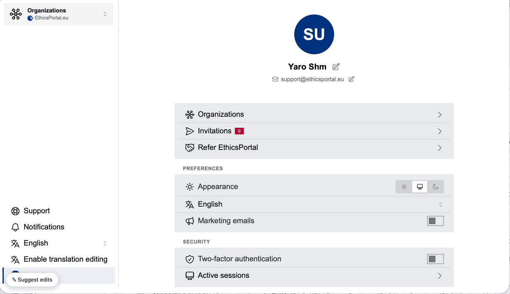
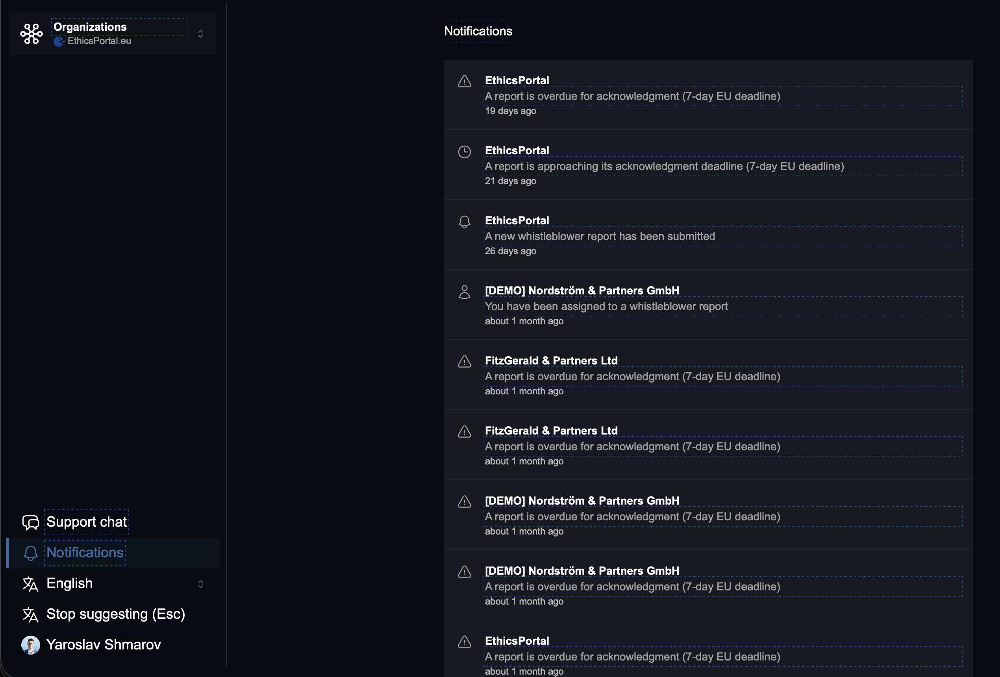
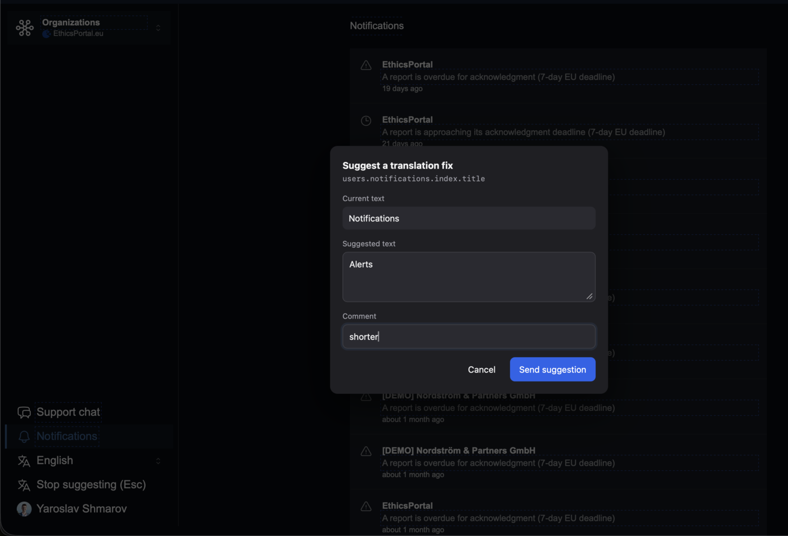
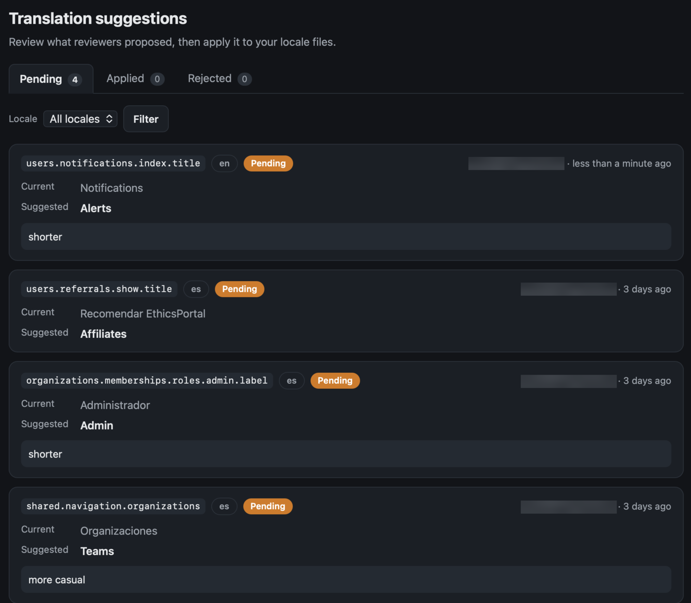

# i18n_proofreading

[](https://rubygems.org/gems/i18n_proofreading)
[](https://rubygems.org/gems/i18n_proofreading)
[](https://github.com/yshmarov/i18n_proofreading/actions/workflows/ci.yml)
[](MIT-LICENSE)

**In-context translation proofreading for Rails.** Your reviewer clicks any
string in the running app and suggests a better wording. You get the i18n key,
the old text, and the proposal — without anyone opening a YAML file.



<sub>[Watch as MP4](https://github.com/yshmarov/i18n_proofreading/raw/main/docs/demo-640.mp4) (sharper, 3 MB)</sub>

## Install

```ruby
# Gemfile
gem "i18n_proofreading"
```

```bash
bundle install
bin/rails generate i18n_proofreading:install
bin/rails db:migrate
```

Optional demo data:

```bash
bin/rails i18n_proofreading:seed_demo
```

It creates three idempotent sample suggestions across pending, applied, and
rejected states. Running the task again refreshes those records instead of
duplicating them.

Boot the app in development and look for the **"Suggest edits"** pill in the
bottom-left. Click it, then click any text. `Esc` exits.

No layout change needed — the widget injects itself into HTML responses.

> [!IMPORTANT]
> Development and staging only by design. `enabled_environments` defaults to
> `%w[development staging]`, and the review dashboard defaults to development
> only. This is not a production tool.

Ruby >= 3.2 · Rails >= 7.1 · CSRF token comes from `csrf_meta_tags`, already in
a standard Rails layout.

Installing with a coding agent? Point it at [AGENTS.md](AGENTS.md) — the same
steps in the order an agent needs them, the gates it tends to get wrong, and the
things it should not do (starting with: this gem never writes your locale files).
It ships inside the gem, so `cat "$(bundle show i18n_proofreading)/AGENTS.md"`
works from any app that bundles it.

## What you get

|                |                                                                     |
| -------------- | ------------------------------------------------------------------- |
| **Highlight**  | Every translated string outlined in the live app, mapped to its key  |
| **Suggest**    | Click a string → current text, your proposal, an optional comment    |
| **Review**     | Built-in board: pending / applied / rejected, filtered by locale     |
| **Storage**    | `i18n_proofreading_suggestions` — ordinary Active Record rows        |
| **Deps**       | None. Plain JS — no Tailwind, no Stimulus, no importmap, no build step |
| **Layout**     | Auto-injected. Opt out and place the tag yourself if you prefer      |
| **Auth**       | Lambdas over the raw request — Devise, Rails 8 auth, feature flags   |
| **i18n**       | The tool's own UI ships in 26 languages, RTL mirrored                |
| **Theme**      | Follows system light/dark                                            |
| **Turbo/CSP**  | Turbo Drive and strict nonce-based CSP (incl. `strict-dynamic`)      |

## The flow

| 1. Turn it on — every translated string is outlined |
| --- |
|  |
| Markers are only emitted while a reviewer has the tool switched on, so pages are clean by default. |
| **2. Click any string and propose a wording** |
|  |
| The popover shows the i18n key, the current text, any pending suggestions, and a comment field. |
| **3. Triage what came in** |
|  |
| Read-only by design — the gem never writes to your locale files. You make the edit. |

## How it works

1. In an enabled environment, the I18n backend appends a hidden `⟦some.key⟧`
   marker to each translated string — only while a reviewer has the tool on
   (a cookie), so pages are clean by default.
2. The widget strips every marker out of the DOM on load and remembers which
   key produced each piece of text.
3. Clicking a string opens a popover: current text, pending suggestions, and a
   field to propose new wording.
4. Suggestions `POST` to the mounted engine and land in
   `i18n_proofreading_suggestions`.

## Configure

Everything is optional — the defaults work out of the box in development. In
`config/initializers/i18n_proofreading.rb`:

| Option | Default | What it does |
| --- | --- | --- |
| `enabled_environments` | `%w[development staging]` | Environments the tool is active in |
| `enabled` | everyone | Extra per-request gate. `false` hides the tool |
| `authorize_admin` | development only | **Who can open the review board.** Independent of the gates above |
| `base_controller_class` | `ActionController::Base` | Controller the dashboard inherits — name your admin's and it adopts its layout, helpers and auth |
| `current_user` | `nil` | Attribute a suggestion to a user. Receives the request |
| `author_label` | the user's `email` | Label shown for the author |
| `available_locales` | `I18n.available_locales` | Which locales a suggestion may target |
| `auto_inject` | `true` | Inject the widget into HTML responses |
| `show_pill` | `true` | The floating "Suggest edits" pill |
| `pill_label` | `nil` | Fixed pill text. `nil` uses the localized default |
| `toggle_param` | `"i18n_proofreading"` | Query param that toggles suggest mode |
| `mount_path` | `"/i18n_proofreading"` | Keep in sync with `mount` in `routes.rb` |
| `on_submit` | no-op | Runs inline after each save — Slack, email, tickets |
| `rate_limit` | `{ to: 30, within: 1.minute }` | Per-IP throttle (Rails 7.2+). `nil` disables |

Gates receive the **raw request**, so they work with any auth:

```ruby
# Only signed-in staff
config.enabled = ->(request) { request.env["warden"]&.user&.staff? }

# Behind a feature flag
config.enabled = ->(request) { Flipper.enabled?(:i18n_proofreading) }

# Devise / Warden
config.current_user    = ->(request) { request.env["warden"]&.user }
config.authorize_admin = ->(request) { request.env["warden"]&.user&.admin? }

# Rails 8 built-in auth (bin/rails generate authentication)
config.current_user = lambda do |request|
  token = request.cookies["session_token"]
  Session.find_signed(token)&.user if token
end

# Ping me when a suggestion lands
config.on_submit = ->(s) { SuggestionMailer.with(suggestion: s).created.deliver_later }
```

<details>
<summary><b>Toggling suggest mode from your own link</b></summary>

Prefer a menu item over the floating pill? Drive suggest mode from any link —
and optionally hide the pill with `config.show_pill = false` (the two can also
coexist).

A one-way "turn it on" link is just the toggle parameter:

```erb
<%= link_to t("i18n_proofreading.start"), "?i18n_proofreading=true" %>
```

For a single control that flips both ways, read the cookie and point at the
opposite state. The gem ships `start` and `stop` labels in every bundled
language:

```erb
<% if I18nProofreading.available?(request) %>
  <% suggesting = cookies[:i18n_proofreading].present? %>
  <%= link_to (suggesting ? t("i18n_proofreading.stop") : t("i18n_proofreading.start")),
              "?#{I18nProofreading.config.toggle_param}=#{!suggesting}" %>
<% end %>
```

Three things worth knowing:

- `?i18n_proofreading=true` turns it on, `false` off. State lives in the
  `i18n_proofreading` cookie; the middleware then redirects to the same URL
  without the parameter, so it never sticks in the address bar.
- These links keep working **while suggest mode is active**. The widget freezes
  ordinary navigation during proofreading so a stray click can't leave the page
  mid-edit — but any link carrying the toggle parameter is exempt.
- The `i18n_proofreading.*` scope is **exempt from key-marking**, so the tool
  never flags its own controls as editable. No plain-literal workaround needed.

</details>

<details>
<summary><b>Placing the widget yourself</b></summary>

Set `config.auto_inject = false` and drop the helper at the end of your layout:

```erb
<%= i18n_proofreading_tag %>
```

It renders nothing unless the tool is available for the request.

</details>

## Reviewing suggestions

The engine root (default `/i18n_proofreading`) is a **read-only** board:
pending / applied / rejected tabs with counts, a per-locale filter, and each
suggestion shown as current-vs-proposed with its comment and author.

Read-only is deliberate. The gem never writes to your locale files, so it
doesn't pretend to — you review here, then edit your own
`config/locales/*.yml`.

Its gate, `authorize_admin`, is independent of `enabled` /
`enabled_environments`: the widget can be dev/staging-only while a maintainer
triages from production.

Suggestions are also ordinary records:

```ruby
I18nProofreading::Suggestion.where(status: "pending").newest_first.each do |s|
  puts "#{s.locale} #{s.translation_key}: #{s.old_value.inspect} -> #{s.proposed_value.inspect}"
end
```

Each row stores `translation_key`, `locale`, `old_value`, `proposed_value`,
`comment`, `page_url`, `status`, and optional `author_id` / `author_label`.

<details>
<summary><b>Statuses</b></summary>

Every suggestion is `pending`, `applied`, or `rejected`
(`I18nProofreading::Suggestion::STATUSES`), backed by an Active Record enum.
New suggestions start `pending`; once you apply a wording or decide against it,
set the status so the popover stops offering it as pending context:

```ruby
suggestion.status_applied!                                # bang setter
suggestion.status_applied?                                # => true
I18nProofreading::Suggestion.status_pending.newest_first  # scope per status
```

</details>

## Localization

The pill and popover speak the app's language — every string resolves through
Rails I18n under `i18n_proofreading.*` and follows the language the page was
rendered in (`<html lang>`, falling back to `I18n.locale`). 26 languages ship,
missing keys fall back to English, and RTL locales render the popover
right-to-left.

<details>
<summary><b>Bundled languages, and overriding the copy</b></summary>

Arabic, Bengali, Bulgarian, Chinese (Simplified), Croatian, Dutch, English,
French, German, Greek, Hindi, Indonesian, Italian, Japanese, Korean,
Luxembourgish, Polish, Portuguese, Romanian, Russian, Spanish, Thai, Turkish,
Ukrainian, Urdu, Vietnamese.

Define the keys in your own locale files — yours win over the gem's:

```yaml
# config/locales/fr.yml
fr:
  i18n_proofreading:
    pill: "Proposer des corrections"
    pill_active: "En cours — appuyez pour quitter (Échap)"
    title: "Proposer une correction de traduction"
    current_text: "Texte actuel"
    suggested_text: "Texte proposé"
    comment: "Commentaire"
    comment_placeholder: "Note facultative pour le développeur"
    prior_title: "Déjà proposé (en attente)"
    cancel: "Annuler"
    save: "Envoyer la suggestion"
    error_blank: "Veuillez saisir une suggestion."
    error_save: "Impossible d'enregistrer la suggestion."
```

`config.pill_label` overrides the pill text with a fixed string; leave it `nil`
to use the localized `i18n_proofreading.pill` key.

</details>

## Security

- **Gated on the server** for every marker, endpoint, and injection. Setting
  the cookie by hand does nothing outside an enabled environment where
  `enabled` returns true.
- **Format and lookup namespaces are never marked** (`number.*`, `date.*`,
  `*_html` formats), so currency and date formatting are unaffected.
- **CSP nonce carried** from `ActionDispatch`, so it runs under a nonce-based
  `script-src` including `strict-dynamic`. Runtime config ships as
  `<script type="application/json">` (data, not code), so it needs no nonce and
  survives Turbo visits.
- **Rate-limited per IP** on the submission endpoint (30/min by default,
  Rails 7.2+).

## Development

```bash
bin/setup
bundle exec rake test         # unit + integration
bundle exec rake test:system  # browser tests (headless Chrome)
bundle exec rubocop
```

Tests run against a dummy Rails app in `test/dummy`.

## Also by the same author

- [testimonials](https://github.com/yshmarov/testimonials) — testimonials,
  reviews and NPS for Rails.
- [ideasbugs](https://github.com/yshmarov/ideasbugs) — in-app bug reports and
  feature requests.
- [SupeRails](https://superails.com) — Rails screencasts.

## License

MIT.
